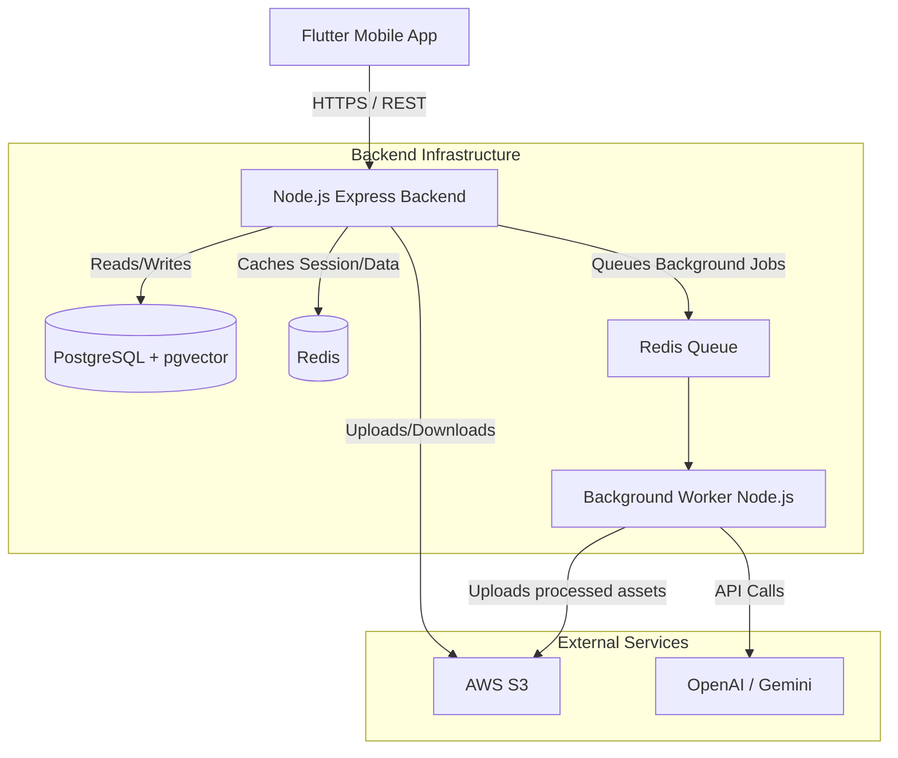
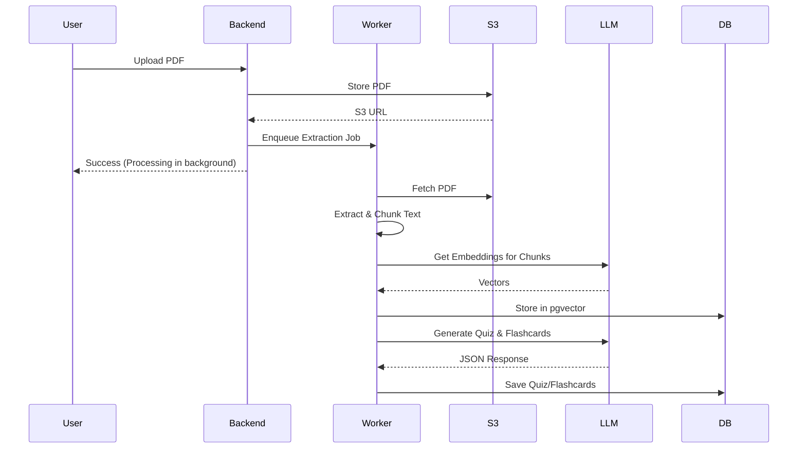

# System Architecture: StudySphere AI

## 1. High-Level Architecture
StudySphere AI follows a client-server architecture with a robust backend to handle heavy AI processing asynchronously. 

- **Client:** Flutter Mobile App (iOS & Android).
- **API Gateway / Backend:** Node.js + Express.js.
- **Primary Database:** PostgreSQL (managed via Prisma ORM) holding relational data and vector embeddings (`pgvector`).
- **Caching & Message Broker:** Redis.
- **Storage:** AWS S3 (PDFs, Images, Audio).
- **AI Services:** OpenAI/Gemini APIs.

## 2. Component Diagram



## 3. AI & RAG (Retrieval-Augmented Generation) Architecture
To ensure the AI Tutor is accurate and context-aware of the student's materials, we use a RAG pipeline.

### 3.1 Document Ingestion Pipeline
1. **Upload:** User uploads PDF to the backend. Backend streams it directly to AWS S3 and returns a URL.
2. **Queue:** Backend adds a `process_pdf` job to the Redis queue.
3. **Extraction:** Background worker downloads PDF, extracts text (using tools like `pdf-parse` or OCR if scanned).
4. **Chunking:** Text is split into overlapping chunks (e.g., 1000 tokens with 200 token overlap).
5. **Embedding:** Chunks are sent to an embedding model (e.g., `text-embedding-3-small`).
6. **Storage:** Vectors and metadata are stored in PostgreSQL using the `pgvector` extension.
7. **Generation:** Worker prompts the LLM to generate summaries, MCQs, and flashcards from the text, storing them in PostgreSQL.



### 3.2 Chat / Retrieval Pipeline
1. **Query:** User asks AI Tutor: "Explain the third formula in this PDF."
2. **Embedding:** Backend embeds the user's query.
3. **Similarity Search:** Backend performs a cosine similarity search in `pgvector` to find the top 5 most relevant chunks from that specific PDF.
4. **Prompting:** Backend constructs a prompt containing the user's query and the retrieved chunks as context.
5. **Response:** LLM generates the final answer, which is streamed back to the user.

## 4. Frontend Architecture (Flutter)
- **State Management:** Riverpod.
- **Routing:** GoRouter for deep linking and declarative routing.
- **Structure:** Feature-first approach (`lib/features/auth`, `lib/features/pdf`, etc.).
- **Design System:** Material 3 with customizable theme tokens (Light/Dark mode).

## 5. Backend Folder Structure
A robust modular monolithic approach.
```
backend/
├── src/
│   ├── app.js               # App entrypoint
│   ├── config/              # Env vars, DB config
│   ├── controllers/         # Route handlers
│   ├── routes/              # Express route definitions
│   ├── middleware/          # Auth, validation, error handling
│   ├── services/            # Business logic (e.g., AuthService)
│   ├── ai/                  # RAG logic, LangChain/OpenAI wrappers
│   ├── jobs/                # Background job processors (BullMQ)
│   ├── utils/               # Helpers, formatters
│   └── tests/               # Unit and integration tests
├── prisma/
│   └── schema.prisma        # Database schema models
└── package.json
```
